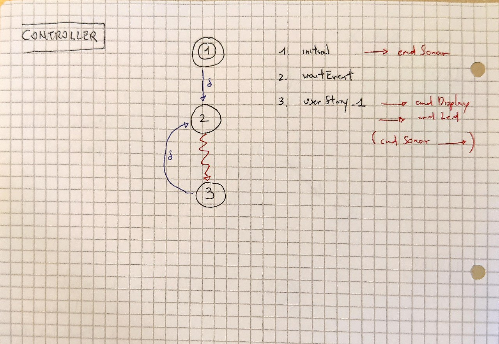
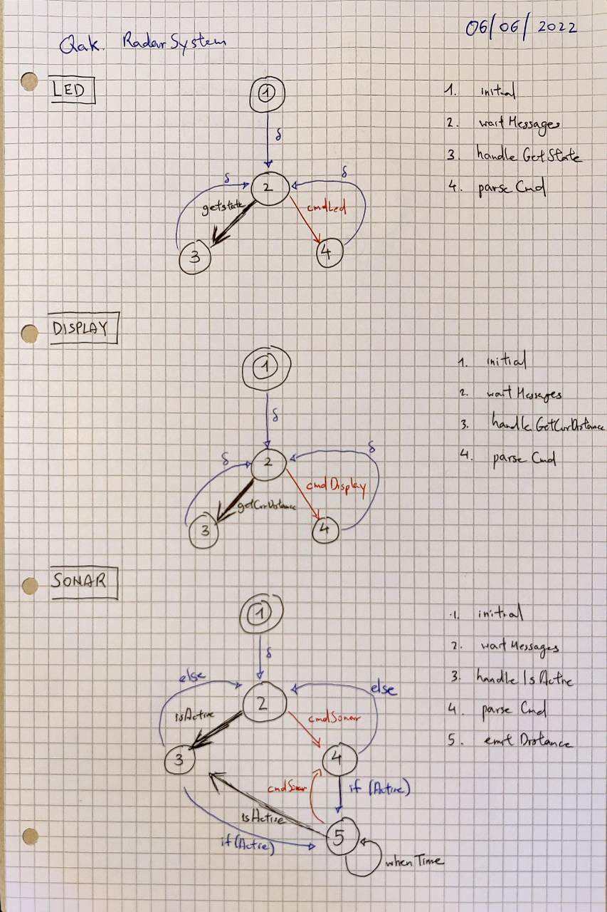

> Introduction

Primo progetto.

> Requirements

Si desidera costruire un'applicazione software capace di:

(requisito radarGui) 
* mostrare le distanze rilevate da un sensore Sonar HC-SR04 connesso a un RaspberryPi su un display (RadarDisplay) a forma di radar connesso a un PC.

(requisito ledAlarm) 
* accendere un Led se la distanza rilevata dal Sonar è inferiore a un valore limite prefissato denominato DLIMIT.

> Requirement analysis

(requisito radarGui)
* viene specificato che il sistema è intrinsecamente distribuito, almeno in due locazioni
    * uno per il sonar
    * uno per il display
* Il sonar deve essere reattivo tempestivamente alla distanza, **non può essere anche responsabile** dell'invio del dato ad altri ed accertare che questi ricevitori (RadarDisplay) lo riceva
    * È definito se il display deve ricevere TUTTI i dati oppure può perderne alcuni? magari un minimo rate di dati per unità di tempo

(requisito ledAlarm)
* il limite DLIMIT deve essere configurabile dopo la configurazione, prima dell'esecuzione del sistema
* non c'è scritto dove si trova il led, per generalità suppongo che sia in una locazione ancora più diversa dalle due precedenti

---

> Problem analysis

Il cuore del problema è capire cosa deve fare ogni singolo componente all'interno del sistema

Possiamo identificare i 3 componenti di "dominio", ovvero non dipendenti dal nostro problema
* Input
    * Sonar
* Output 
    * Led
    * Display

E un componente per ogni userStory del nostro problema
* Controller

Mostriamo le macchine a stati dei singoli componenti                                                               

>> User stories

(USR_1)
* User-story US1: come utente mi aspetto che il Led si accenda se pongo un ostacolo a distanza d\<DLIMIT\> dal Sonar e che il Led si spenga non appena porto l’ostacolo ad una distanza d\<DLIMIT\>. In ogni caso posso vedere illuminarsi un punto sul RadarDisplay a distanza d dal centro lungo una retta che forma un angolo rispetto all’asse orizzontale del display.

A fine di test, il prototipo eseguibile mostrerà lo svolgimento della user-story con le seguente semplificazioni
* DLIMIT 
    * variabile di Controller
* Sonar 
    * simula un fonte di valori da 90 a 0, calando di 5 ogni invio
* Led 
    * lo stato di accensione è determinato da una variabile booleana
* Display  
    * il valore corrente è un intero
> Test plans

> Project

> Testing

> Deployment

> Maintenance
